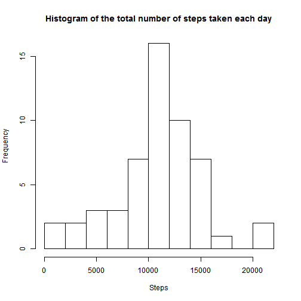
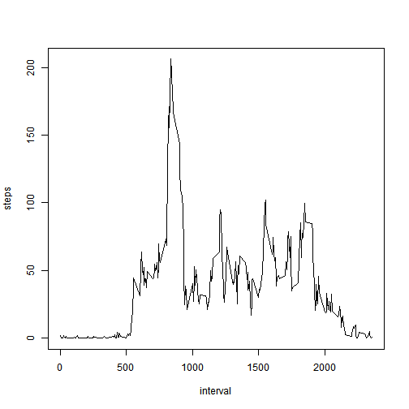
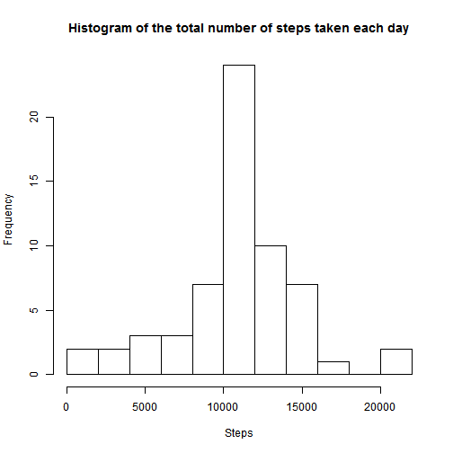
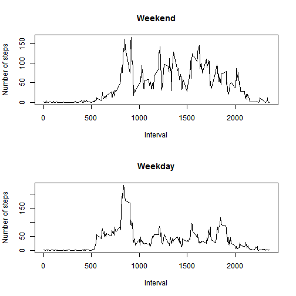

This assignment makes use of data from a personal activity monitoring device. This device collects data at 5 minute intervals through out the day. The data consists of two months of data from an anonymous individual collected during the months of October and November, 2012 and include the number of steps taken in 5 minute intervals each day.

The variables included in this dataset are:
1. steps: Number of steps taking in a 5-minute interval (missing values are coded as NA)
2. date: The date on which the measurement was taken in YYYY-MM-DD format
3. interval: Identifier for the 5-minute interval in which measurement was taken
The dataset is stored in a comma-separated-value (CSV) file and there are a total of 17,568 observations in this dataset.

##Loading and preprocessing the data


```r
    library(fields)
    # load data
    file <- read.csv("activity.csv")
    
    #process/transform data
    file$steps <- as.numeric(as.character(file$steps))
    file$date <- as.Date(as.character(file$date))
    file$interval <- as.integer(as.character(file$interval))
```


##What is mean total number of steps taken per day?

```r
    # select rows without NA
    valid <-na.omit(file)
    
    # find total number of steps taken each day
    by_date <- aggregate(steps ~ date, data=valid, FUN = sum)
    
    #histogram
    hist(by_date$steps, breaks=8, main = "Histogram of the total number of steps taken each day", xlab = "Steps")
```

 

```r
    # mean and median total number of steps taken each day
    cat("Mean:")
```

```
## Mean:
```

```r
    mean(by_date$steps)
```

```
## [1] 10766.19
```

```r
    cat("Median:")
```

```
## Median:
```

```r
    median(by_date$steps)
```

```
## [1] 10765
```

##What is the average daily activity pattern? 

```r
    # group records by interval
    by_interval <- aggregate(steps ~ interval, data=valid, FUN = mean)
    
    #plot a time series plot
    plot(by_interval, type="l")
```

 

```r
    # find interval with maximum number of steps
    cat("Maximum number of steps:")
```

```
## Maximum number of steps:
```

```r
    by_interval$interval[by_interval$steps == max(by_interval$steps)]
```

```
## [1] 835
```
##Imputing missing values

```r
    #check where NA is
    sum(is.na(file$steps))
```

```
## [1] 2304
```

```r
    sum(is.na(file$date))
```

```
## [1] 0
```

```r
    sum(is.na(file$interval))
```

```
## [1] 0
```

```r
    #conclusion: only steps has NA
    
    #select all records with NA
    isNA <- file[is.na(file$steps) == TRUE,]
    
    #number of NA rows
    cat("Total number of missing values:")
```

```
## Total number of missing values:
```

```r
    dim(isNA)[1]
```

```
## [1] 2304
```

```r
    #replace NA with average steps across all days of the corresponding interval
    interval <- by_interval[,1]
    for (i in interval){
        isNA$steps[isNA$interval == i] <- by_interval$steps[by_interval$interval== i]
    }
    # recombine the records with and without NA and then sort
    recombine <- rbind(valid, isNA)
    recombine <- recombine[order(recombine$date, recombine$interval),]
    
    # find total number of steps taken each day
    by_date_r <- aggregate(steps ~ date, data=recombine, FUN = sum)
    
    #create histogram
    hist(by_date_r$steps, breaks=8, main = "Histogram of the total number of steps taken each day", xlab="Steps")
```

 

```r
    #mean and median
    cat("Mean:")
```

```
## Mean:
```

```r
    mean(by_date_r$steps)
```

```
## [1] 10766.19
```

```r
    cat("Median:")
```

```
## Median:
```

```r
    median(by_date_r$steps)
```

```
## [1] 10766.19
```
**Conclusion: no big change from original data because the mean is used.**

##Are there differences in activity patterns between weekdays and weekends?

```r
    #create a new column of weekday by converting date into day of the week
    recombine$weekday <- weekdays(recombine$date)
    
    #convert date of the week into either weekday or weekend
    recombine$weekday[recombine$weekday == "Monday"] <- "weekday"
    recombine$weekday[recombine$weekday == "Tuesday"] <- "weekday"
    recombine$weekday[recombine$weekday == "Wednesday"] <- "weekday"
    recombine$weekday[recombine$weekday == "Thursday"] <- "weekday"
    recombine$weekday[recombine$weekday == "Friday"] <- "weekday"
    recombine$weekday[recombine$weekday == "Saturday"] <- "weekend"
    recombine$weekday[recombine$weekday == "Sunday"] <- "weekend"
    
    # group records by weekday and weekend
    weekend <- recombine[which(recombine$weekday == "weekend"),]
    weekday <- recombine[which(recombine$weekday == "weekday"),]
    
    # group records by interval
    weekend_interval <- aggregate(steps ~ interval, data=weekend, FUN = mean)
    weekday_interval <- aggregate(steps ~ interval, data=weekday, FUN = mean)
    
    #create panel plots
    set.panel(2,1)
```

```
## plot window will lay out plots in a 2 by 1 matrix
```

```r
    plot(weekend_interval$steps ~weekend_interval$interval, type="l", xlab = "Interval", ylab = "Number of steps", main="Weekend")
    plot(weekday_interval$steps ~weekday_interval$interval, type="l", xlab = "Interval", ylab = "Number of steps", main ="Weekday")
```

 

**Conclusion: the subject walks more over the weekend. The subject's day activities during the weekdays are sedentary.** 
